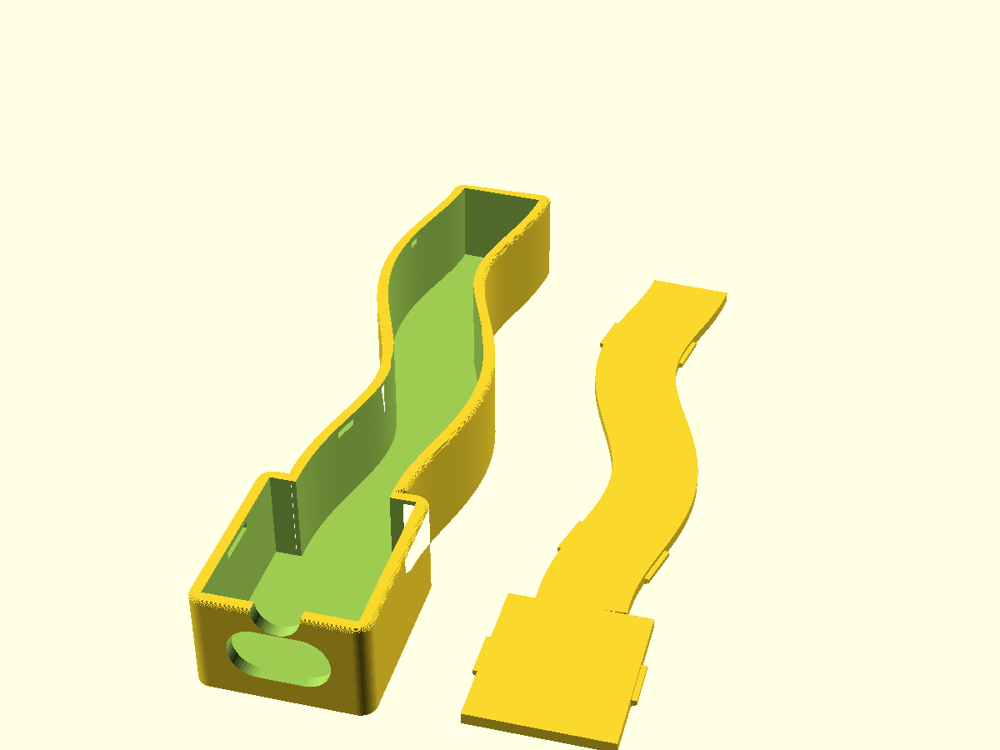

# Mariko Earthgrids — Xiao + LoRa Phone-Mount Case

Parametric OpenSCAD enclosure for a Seeed Xiao + LoRa board that mounts on
the back of a phone, connected by a short right-angle USB-C cable. Designed
for and branded as a Mariko Earthgrids field device, carrying the Reality2
network hallmark.



## Design overview

- **Inverted mounting**: the solid printed floor is the *visible outer face*
  when installed; the click-in lid faces the phone (which also backs it up
  mechanically). Total profile: **13.1 mm**.
- **Meandering antenna channel**: the LoRa / WiFi-BLE wire antennas lie in a
  gentle S-curve trough (75 mm), enclosed by the same one-piece lid. The
  curve is a smooth function with zero slope at both ends
  (`ch_px(t)` in the source).
- **One-piece click-in lid** covering box + channel: flat 1.5 mm plate,
  seated 0.2 mm below the rim, retained by six ramped snap bumps engaging
  recesses in the inner walls (two on the box, four along the channel,
  placed in local path frames so they follow the curve). Pry notch at the
  channel's far end — peel the lid from the thin end.
- **Branding, debossed 0.4 mm into the visible face** (prints as crisp
  first-layer engraving on the bed):
  - Mariko tree mark — auto-traced from the actual logo
    (`mariko_logo_traced.scad`, IoU 0.93 vs source image), mirrored so it
    reads correctly after the installation flip.
  - Braided river waves flowing along the meander.
  - Reality2 hexagon: pointy-top ring with hub-and-five-spokes node
    network (top vertex direction empty, per the R2 mark).
- **USB-C**: stadium-shaped window (12.6 x 7.0 mm) in the short wall,
  matching the plug's own cross-section. Plug inserts from outside after
  the board is seated (USB-C is reversible; ribbon exits toward the phone).
  Sized for the Adafruit 6367 slim right-angle cable
  (DigiKey 1528-6367-ND) — calliper your plug and tune `usb_w`/`usb_h`.

## Files

| file | purpose |
|---|---|
| `xiao_case.scad` | the design (all parameters at the top) |
| `mariko_logo_traced.scad` | traced Mariko tree polygon data — **required dependency** |
| `interference.scad` | boolean fit-test scene used by the check script |
| `seated.scad` | preview scene: lid seated on case |
| `scripts/check_fit.py` | snap-fit verification (run before printing after any geometry change) |
| `stl/` | ready-to-print exports |
| `images/` | renders and the logo trace comparison |

## Printing

- Two parts, both print flat as exported, **no supports**.
- Case: floor on the bed — the branding is bed-face engraving. A 0.2 mm
  first layer keeps the koru spirals and R2 spokes sharp (they sit at
  ~0.4–0.5 mm feature size). Textured or smooth PEI both look good.
- Lid: prints flat on its top face.
- Material: PLA or PETG. Snap tuning knobs: `tol` (0.3), `snap_depth` (0.7).

## Assembly

1. Seat the board in the box (component side up, USB end at the window).
2. Feed the antennas into the meander trough.
3. Click the lid in: box end first, then press along the channel.
4. Insert the USB-C plug through the window from outside, ribbon toward
   the rim (phone side).
5. Mount rim-side against the phone.

To open: fingernail in the far-end notch, peel the lid along the channel.

## Verification workflow

Geometry changes should pass the interference test before printing:

```
python3 scripts/check_fit.py
```

`closed ~0 mm³` proves the lid seats; `lifted >0` proves all six clips
catch. If you change heights (`lid_h`, `seat`, `floor`, `board_h`), update
`LID_Z0` in the script to the new `outer_h - seat - lid_h`.

## Key parameters

All at the top of `xiao_case.scad`: board envelope (`board_*`), USB window
(`usb_*`), meander (`ant_channel_len/w`, `ant_curve`), shell (`wall`,
`floor`), lid/snap (`lid_h`, `seat`, `snap_*`, `tol`), branding (`deboss`,
`wave_*`, `hex_*`, `r2_*`), and cosmetics (`corner_r`, `chan_end_r`,
`top_round`).
