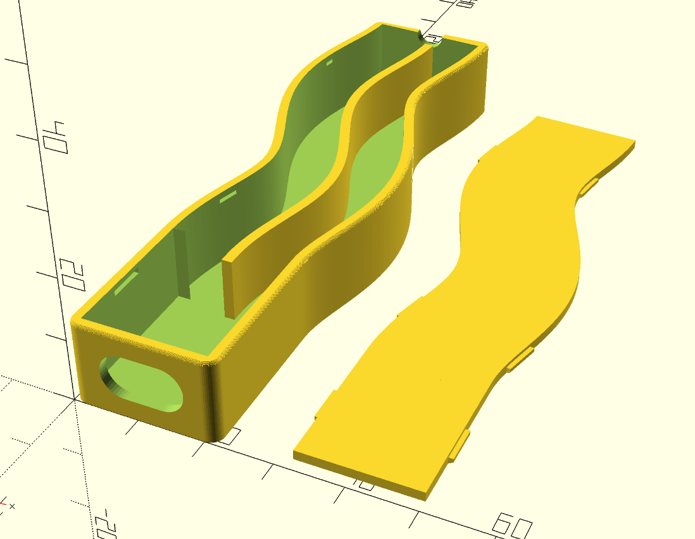
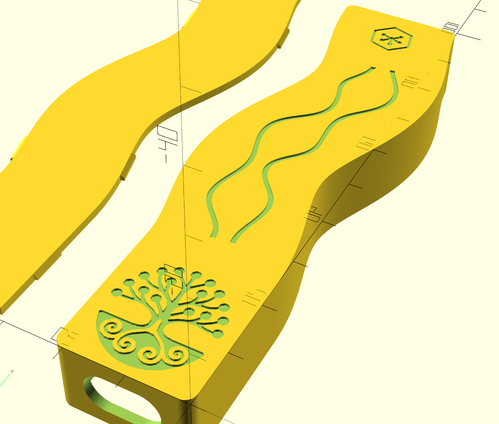

# Xiao + LoRa Phone-Mount Case

Parametric OpenSCAD enclosure for a Seeed Xiao + LoRa board that mounts on the back of a phone, connected by a short right-angle USB-C cable. Designed for and branded as a Mariko Earthgrids field device, carrying the Reality2 network hallmark.




## Design overview

- **Inverted mounting**: the solid printed floor is the *visible outer face* when installed; the click-in lid faces the phone. Total profile: **13.1 mm**.
- **Meandering antenna channel, full body width**: the channel is the same outer width as the box, split lengthwise by a central divider into **two 8 mm lanes** — one per antenna (LoRa | WiFi/BLE). 75 mm long; the curve is a smooth function with zero slope at both ends. The divider also serves as the board's central back-stop.
- **One-piece click-in lid** covering box + channel: flat 1.5 mm plate, seated 0.2 mm below the rim, retained by six ramped snap bumps. Pry notch at the channel's far end.
- **Branding, debossed 0.4 mm into the visible face**: Mariko tree mark, braided river waves along the meander, and Reality2 hexagon hallmark.
- **USB-C**: stadium-shaped window (12.6 x 7.0 mm) sized for Adafruit 6367 slim right-angle cable.

## Files

| file | purpose |
|---|---|
| `src/xiao_case.scad` | the design (all parameters at the top) |
| `src/mariko_logo_traced.scad` | traced Mariko tree polygon data — **required dependency** |
| `test/interference.scad` | boolean fit-test scene |
| `test/seated.scad` | preview scene: lid seated on case |
| `scripts/check_fit.py` | snap-fit verification (run before printing) |
| `stl/` | ready-to-print exports |
| `images/` | renders and reference images |

## Printing

- Two parts, both print flat as exported, **no supports**.
- Case: floor on the bed — the branding is bed-face engraving. A 0.2 mm first layer keeps the koru spirals and R2 spokes sharp.
- Lid: prints flat on its top face.
- Material: PLA or PETG. Snap tuning knobs: `tol` (0.3), `snap_depth` (0.7).

## Assembly

1. Seat the board in the box (component side up, USB end at the window).
2. Feed the antennas into the meander trough (left antenna to left lane, right to right lane).
3. Click the lid in: box end first, then press along the channel.
4. Insert the USB-C plug through the window from outside, ribbon toward the rim (phone side).
5. Mount rim-side against the phone.

To open: fingernail in the far-end notch, peel the lid along the channel.

## Verification workflow

Geometry changes should pass the interference test before printing:

```bash
python3 scripts/check_fit.py
```

`closed ~0 mm³` proves the lid seats; `lifted >0` proves all six clips catch.

## Key parameters

All at the top of `src/xiao_case.scad`: board envelope (`board_*`), USB window (`usb_*`), meander (`ant_channel_len/w`, `ant_curve`), shell (`wall`, `floor`), lid/snap (`lid_h`, `seat`, `snap_*`, `tol`), branding (`deboss`, `wave_*`, `hex_*`, `r2_*`), and cosmetics (`corner_r`, `chan_end_r`, `top_round`).
